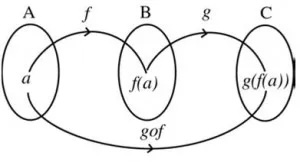
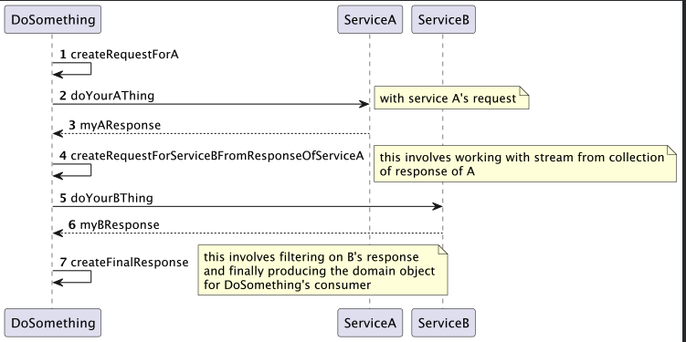
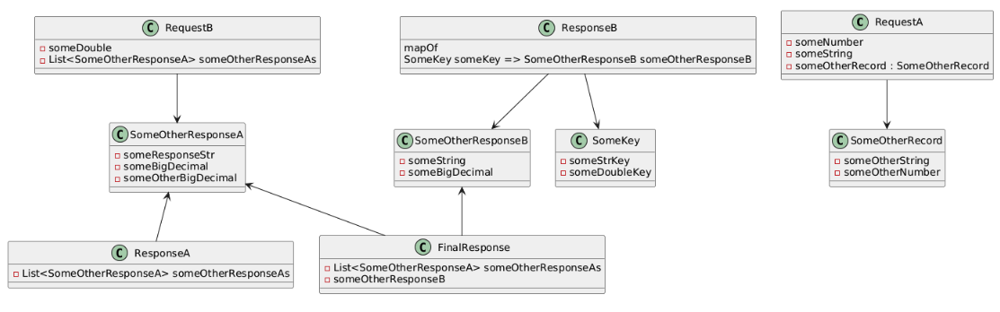

## Business logic as pipeline code

### The monadic design pattern
We are going to see how we can write Java business logic as pipeline code.

- This involves usage of the powerful CompletableFuture of JDK
- Stream derivatives

### CompletableFuture example 
```java
CompletableFuture<String> completableFuture
        = CompletableFuture.supplyAsync(() -> "Hello");

CompletableFuture<String> future = completableFuture
        .thenApply(s -> s + " World");

assertEquals("Hello World", future.get());
```

### mondaic design patter


```java
addTen(divide(8,2))
```

## Use case

There is an orchestration service let's call is DoSomething , that has an entry point 
which collects responses over 2 services A and B (B depends on the response of A)
and finally produces a composite response which is useful in DoSomethings core logic.




Class diagram
